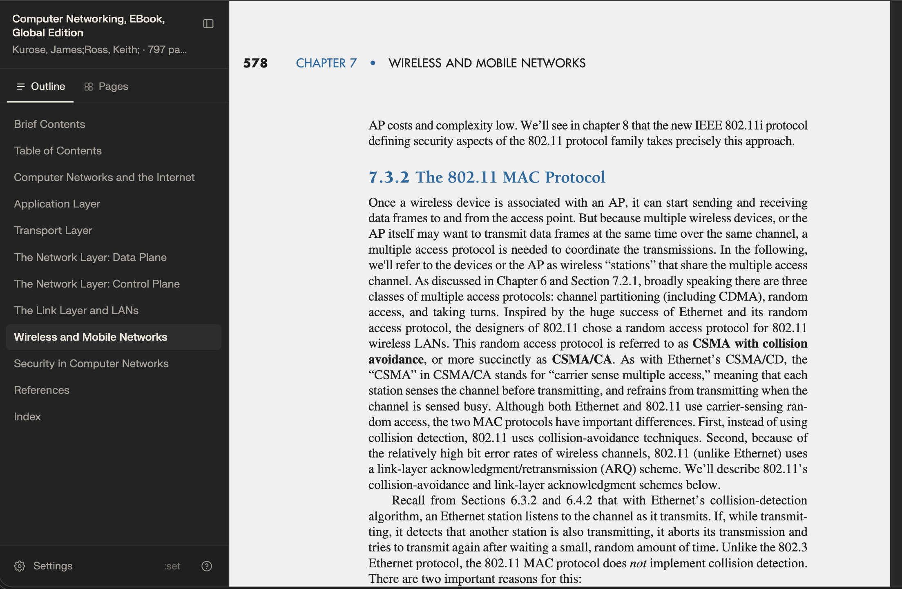
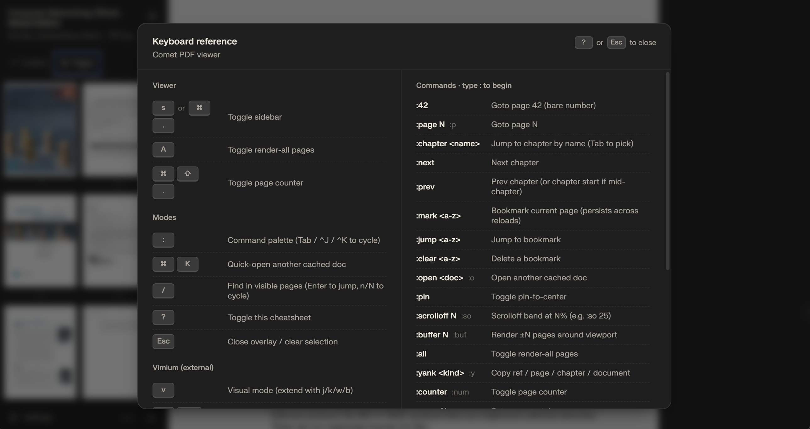
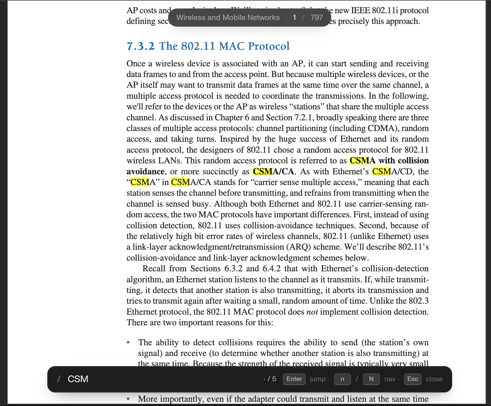
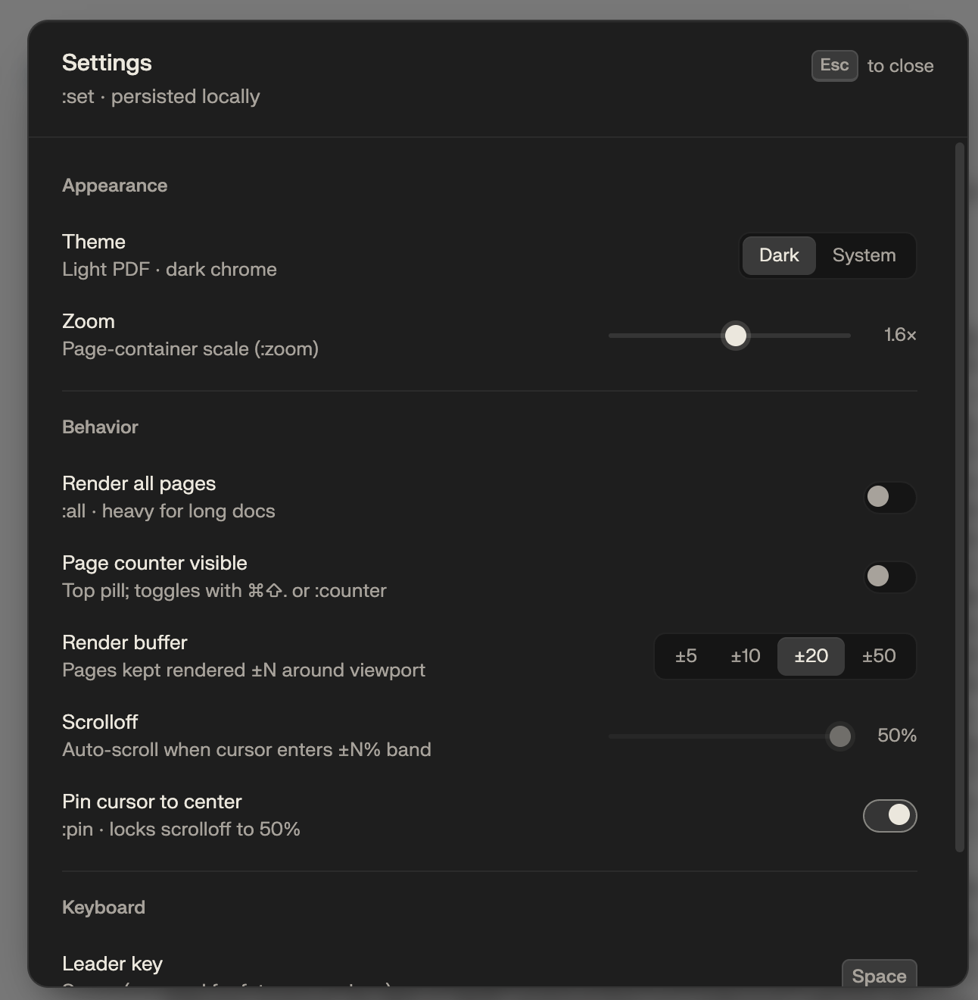
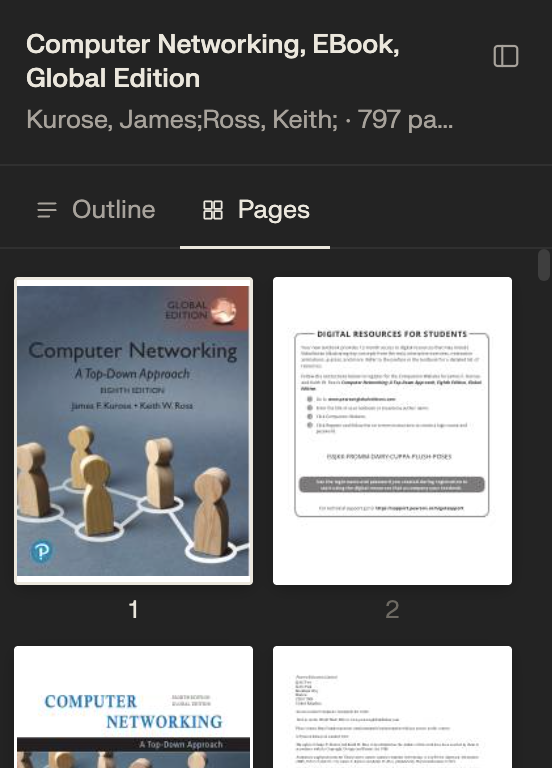

# pdf_viewer

Personal PDF → custom-HTML viewer for a keyboard-native (Vimium) workflow.
Click any `*.pdf` link in Comet, land in a dark, Vim-friendly HTML viewer
instead of Chrome's sandboxed PDF surface.



This README is the orientation doc. For deeper references:
[`docs/cache.md`](docs/cache.md) (cache design),
[`docs/keybindings.md`](docs/keybindings.md) (full key + palette
registry), [`docs/adr/`](docs/adr/) (architectural decisions),
[`CLAUDE.md`](CLAUDE.md) (build / debug / gotchas).

## Why

Vimium — the vim-style keyboard navigation we rely on for everything —
**does not work inside Chrome/Comet's native PDF viewer**. The native
viewer is a sandboxed `chrome://pdf` surface that browser extensions cannot
reach. No `j/k`, no `/`, no visual mode, no marks.

The workaround: render PDFs as **HTML** instead. `pdf2htmlEX` produces
pixel-faithful HTML with selectable text; Vimium treats it like any other
page. Then we inject a JS/CSS overlay to fix the UX (dark canvas, clean
sidebar, render-window, cursor pin, palette, outline tracker, marks,
position restore, …).

## Design philosophy

1. **Cache is load-bearing.** Conversion is slow (Docker + pdf2htmlEX on
   Rosetta-emulated amd64, 1–2 min for a textbook). Convert once, cache
   forever at `~/.cache/pdf_viewer/<hash>/`. Every subsequent open is a
   disk read — 1–3 ms.
2. **Docker on demand.** Docker is the only heavy component. It sits off
   23 h a day. The user starts it manually before the rare "convert a
   batch" session. The daemon never touches Docker (ADR 0004).
3. **Read-only daemon, scary work in Raycast.** FastAPI daemon serves the
   cache and nothing else. All conversion / indexing lives in Raycast
   scripts. If the daemon crashes, no documents are lost; if a script
   breaks, the daemon keeps serving everything already cached.
4. **Extension for frictionless hits; Raycast for deliberate conversions.**
   The MV3 extension redirects `*.pdf` navigations to
   `/view?url=<original>`. Cache hit → instant HTML. Miss → 307 back to
   the original URL (native viewer takes over, degraded but not broken),
   and the user runs Raycast-convert to escalate. Next visit of the same
   doc hits cache forever.
5. **Overlay is the product.** `assets/overlay.{js,css}` is what the user
   actually experiences. Served live via symlink — edits reload on ⌘⇧R,
   no reconversion needed.
6. **Keyboard first.** All numeric arguments go through the `:` palette,
   not `[N]<key>` prefixes. Shortcut conflicts with Vimium are
   non-negotiable — see the "Permanently rejected" list in
   [`docs/keybindings.md`](docs/keybindings.md).

## Current state

All core phases done (1 → 7). What works end-to-end today:

- **Conversion** — `scripts/pdf2html-convert.sh` handles both `file://`
  and `https://` sources (signed Blackboard/S3/CloudFront URLs included;
  query string stripped from the cache key so signed links hit cache
  across sessions). Filename recovered from `Content-Disposition` or
  URL path.
- **Overlay injection** — `scripts/inject-overlay.py`, shared between
  fresh conversions and bulk upgrades. Idempotent.
- **Bulk upgrade** — `scripts/upgrade-cache.sh --mode={inject,reconvert}`.
  `inject` re-applies the overlay to every cached HTML (seconds, no
  Docker). `reconvert` re-runs pdf2htmlEX; for https entries reuses the
  stored `_source/*.pdf` so signed URLs don't need to be refetched.
- **Bulk indexing** — `scripts/index-directory.sh <folder>` recursively
  content-hashes every PDF and converts uncached ones. Raycast wrapper
  takes a folder argument.
- **FastAPI daemon** (`daemon/main.py`, uv project) — read-only. Routes:
  `GET /view?path=` / `GET /view?url=` / `GET /<hash>/<file>` /
  `GET /_assets/*` / `GET /healthz` / `GET /stats` / `GET /stats/recent` /
  `GET /library`. Cache lookup ≈ 1–3 ms.
- **launchd autostart** — `launchd/com.anders.pdf_viewer.plist` symlinked
  into `~/Library/LaunchAgents/`. `KeepAlive=true`, respawns within a
  second if killed; brought up on login.
- **Comet MV3 extension** (`extension/`) — static
  `declarativeNetRequest` rules redirect `^https?://.*\.pdf(\?.*)?$`
  main-frame navigations to the daemon. Loop-prevention via a
  `_pdfvw=passthrough` marker that the daemon appends to its 307 on
  miss.
- **Visit tracking** (`daemon/visits.py` + `visits.db`) — every cache hit
  logged off the response path via FastAPI `BackgroundTasks`. Powers
  `/stats`, `/stats/recent`, and the visits-sorted library picker
  behind `⌘K` / `:open`.

What's not built: cross-device access over Tailscale (phase 8, optional).

## Workflow

- **Cached doc, anywhere on the web** — click the link, land in the HTML
  viewer. No thought.
- **Uncached doc** — click the link, native viewer opens (degraded but
  readable). If you want it in HTML, run Raycast-convert once. Docker
  must be running. Next click forever hits cache.
- **Whole textbook directory** — run Raycast-index-directory against the
  folder. Docker must be running. Idempotent; re-running skips
  already-cached PDFs (content-hash dedup handles renames).

## Components

```
pdf_viewer/
├── assets/overlay.{js,css}      # the overlay — all UX behavior
├── scripts/
│   ├── pdf2html-convert.sh      # convert: single PDF (file or url)
│   ├── index-directory.sh       # index: recursive directory walk
│   ├── upgrade-cache.sh         # bulk re-inject / re-convert
│   └── inject-overlay.py        # idempotent overlay injector
├── raycast/                     # Raycast-format wrappers (point Raycast here)
│   ├── pdf-viewer-convert.sh
│   └── pdf-viewer-index-folder.sh
├── daemon/                      # FastAPI read-only service (uv project)
│   ├── main.py
│   └── visits.py
├── extension/                   # Comet MV3 redirect extension
│   ├── manifest.json
│   └── rules.json
├── launchd/                     # LaunchAgent plist
├── docs/
│   ├── adr/                     # immutable architectural decisions
│   ├── cache.md                 # cache design: layout, hash keys, URL norm
│   ├── keybindings.md           # full key + palette registry
│   ├── non-goals.md             # explicit scope boundaries
│   └── pdf2htmlex-dom.md        # DOM conventions of converted HTML
└── CLAUDE.md                    # guidance for future Claude sessions
```

## Externalities

Everything the repo **does not** contain but depends on. All of it is
wired once and then forgotten.

### 1. Raycast wrappers (`raycast/`)

The user-facing entrypoints live **inside** this repo at `raycast/`.
The folder contains *only* Raycast-format scripts so it can be added
directly as a script directory (Raycast → Settings → Extensions →
Script Commands → *Add script directory* → pick `pdf_viewer/raycast/`)
without Raycast tripping over unrelated files.

They are deliberately **trivial**: a `nohup` fork into the real script,
then `echo` a HUD line and exit. All logic lives in `scripts/` so it
can be edited and tested without Raycast in the loop.

```bash
# raycast/pdf-viewer-convert.sh
nohup /…/pdf_viewer/scripts/pdf2html-convert.sh "$@" \
    >>"$HOME/.cache/pdf_viewer/log" 2>&1 &
disown
echo "pdf_viewer: starting conversion…"
```

```bash
# raycast/pdf-viewer-index-folder.sh
export PATH="$HOME/.local/bin:/opt/homebrew/bin:/usr/local/bin:$PATH"
nohup /…/pdf_viewer/scripts/index-directory.sh "$1" \
    >>"$HOME/.cache/pdf_viewer/log" 2>&1 &
disown
echo "pdf_viewer: indexing folder…"
```

Why `nohup &` + early `echo` instead of `exec`: Raycast's silent mode
only surfaces a HUD at script **completion**. A cache miss is 1–2 min
and a folder index can be tens of minutes — `exec`'ing straight through
would leave the user staring at nothing for that entire window. Forking
into the background makes the HUD fire immediately; the real script
runs to completion on its own and uses macOS notifications for
progress.

### 2. LaunchAgent (`~/Library/LaunchAgents/com.anders.pdf_viewer.plist`)

**Symlinked** into `LaunchAgents/` from `launchd/com.anders.pdf_viewer.plist`
so repo edits propagate on the next
`launchctl kickstart -k gui/$UID/com.anders.pdf_viewer`. User-level
agent, no sudo. `RunAtLoad=true`, `KeepAlive=true`,
`ThrottleInterval=5`. Install/uninstall commands live as comments at
the top of the plist.

### 3. Comet extension (loaded from `extension/`)

Not published to a store. Install manually: `comet://extensions` →
enable Developer mode → *Load unpacked* → point at
`pdf_viewer/extension/`. Two static `declarativeNetRequest` rules
(redirect + passthrough allow). Reloads on every edit to `rules.json`
only after hitting the extension's reload button.

### 4. Runtime cache (`~/.cache/pdf_viewer/`)

Not checked into the repo. Bootstrapped on first run. Full design in
[`docs/cache.md`](docs/cache.md). `_assets/` inside it is a
**symlink** back to the repo's `assets/` so overlay edits go live
without a restart. Nuking the whole cache loses nothing irreplaceable —
next open re-converts.

### 5. Vimium exclusion rule

Add `localhost:7435` to Vimium's "Keys to pass through" with the keys
`? s / n N h l`, otherwise Vimium swallows them before the overlay's
handlers see them. One-time setup in the Vimium options page.

### 6. Docker Desktop

Required **only** when converting — the daemon never touches it
(ADR 0004). `scripts/pdf2html-convert.sh` and `scripts/index-directory.sh`
fail fast with a clear "Docker daemon not running" message if the user
forgets. Do not auto-start Docker from any script.

### Network

Port `7435`, bound to `127.0.0.1`. Deliberately different from the
retired hardcoded script's `7433` so both can run side-by-side during
the migration window.

## Shortcuts (inside converted HTML)

| Key      | Action                                       |
|----------|----------------------------------------------|
| `⌘.` / `⌘B` | Toggle sidebar                            |
| `/` / `s` | Find in visible pages                       |
| `A`      | Toggle render-all pages                      |
| `⌘⇧.`    | Toggle page counter                          |
| `:`      | Open command palette                         |
| `⌘K`     | Library picker (palette seeded with `:open `)|
| `?`      | Cheatsheet (needs Vimium `?` disabled on `localhost:7435`) |
| `Esc`    | Close palette → cheatsheet → clear selection |

Palette: `:42`, `:p 42`, `:chapter <name>`, `:next` / `:prev`,
`:mark <a-z>`, `:jump <a-z>`, `:clear <a-z>`, `:open <doc>` / `:o`,
`:pin`, `:scrolloff 25` / `:so 25`, `:buffer 20` / `:buf 20`, `:all`,
`:yank <ref|page|chapter|document>` / `:y`, `:counter` / `:num`,
`:help` / `:h`.

Full key + palette registry (including the Vimium-reserved keys we
deliberately *don't* bind): [`docs/keybindings.md`](docs/keybindings.md).

## Screenshots

<table>
<tr>
<td width="50%"><br><sub><b>Cheatsheet (<code>?</code>)</b> — all keybindings + palette commands.</sub></td>
<td width="50%"><br><sub><b>Find (<code>/</code>)</b> — search within rendered pages, <code>Enter</code> to jump, <code>n/N</code> to cycle. Page counter pill visible top-center.</sub></td>
</tr>
<tr>
<td width="50%"><br><sub><b>Settings (<code>:set</code>)</b> — theme, zoom, render buffer, scrolloff, cursor pin.</sub></td>
<td width="50%"><br><sub><b>Pages panel</b> — thumbnail grid in the sidebar (toggle Outline / Pages tabs).</sub></td>
</tr>
</table>

## Testing

No automated tests. Verify by running the Raycast shortcut on a local PDF
and inspecting behavior in Comet. Logs at `~/.cache/pdf_viewer/log` —
`tail -f` to watch live.

**Overlay-only changes** (most common): edit `assets/overlay.{js,css}`,
⌘⇧R in an already-open converted tab. Symlink-served, no reconversion.

**Script / injection changes**: `trash ~/.cache/pdf_viewer/<hash>/` to
force re-conversion next run, or bump `OVERLAY_VERSION` in the script to
bust the `<script src=…?v=N>` query-string cache.

## Further reading

- [`CLAUDE.md`](CLAUDE.md) — build / debug / gotchas (also the
  orientation doc Claude sessions are handed)
- [`docs/cache.md`](docs/cache.md) — cache layout, hash keys, URL
  normalization, failure modes
- [`docs/keybindings.md`](docs/keybindings.md) — full key + palette
  registry including Vimium conflicts
- [`docs/non-goals.md`](docs/non-goals.md) — explicit scope boundaries
- [`docs/pdf2htmlex-dom.md`](docs/pdf2htmlex-dom.md) — DOM conventions
  of converted HTML
- [`docs/adr/`](docs/adr/) — architectural decisions: engine choice
  (0001), render-window + cursor pin (0002), keyboard strategy under
  Vimium (0003), docker-on-demand + daemon split (0004), Vimium scroll
  scoping (0005), scrolloff (0006)
