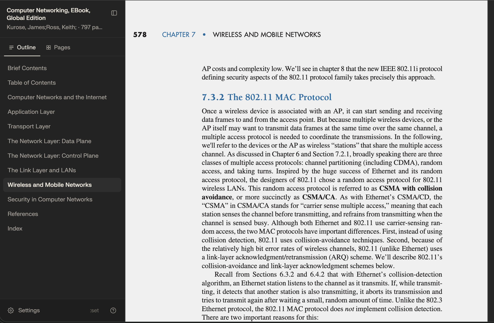
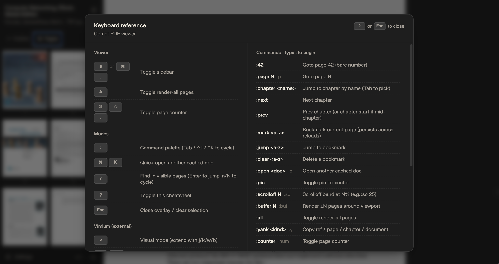
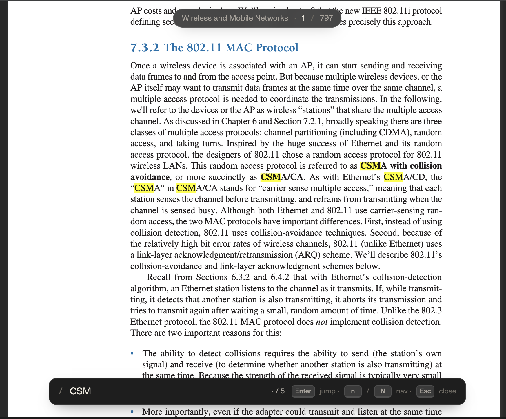
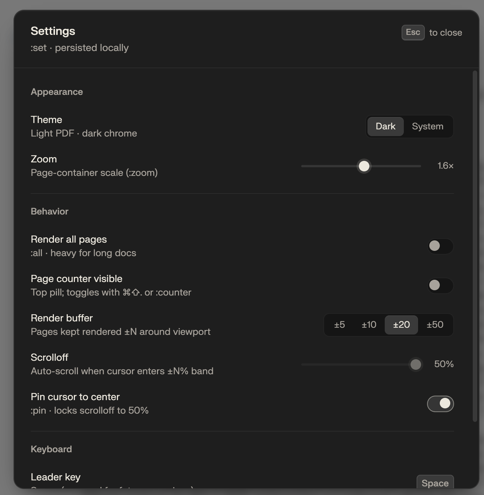
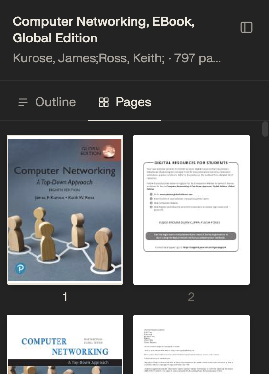

# pdf_viewer

Personal PDF → custom-HTML viewer for a keyboard-native (Vimium) workflow.
Click any `*.pdf` link in Comet, land in a dark, Vim-friendly HTML viewer
instead of Chrome's sandboxed PDF surface.



This README is the orientation doc. For deeper references:
[`docs/cache.md`](docs/cache.md) (cache design),
[`docs/keybindings.md`](docs/keybindings.md) (full key + palette
registry), [`docs/adr/`](docs/adr/) (architectural decisions),
[`docs/ai-production.md`](docs/ai-production.md) (agent workflow +
Beads), [`docs/verification.md`](docs/verification.md) (verification
loops), [`CLAUDE.md`](CLAUDE.md) (build / debug / gotchas).

## Quick start

```bash
git clone <repo> pdf_viewer && cd pdf_viewer
./scripts/setup.sh
```

`scripts/setup.sh` is the idempotent bootstrap — safe to re-run. It
installs the Homebrew runtime deps ([`Brewfile`](Brewfile)), checks for
`uv`, installs the native pdf2htmlEX toolchain, templates and loads the
launchd daemon job, creates the cache dir + `_assets` symlink, and ends
by running [`scripts/doctor.sh`](scripts/doctor.sh) as the success gate.
It needs Homebrew already present and does **not** auto-install `uv`
(it prints the one-liner if missing).

Two manual steps it can't script (it prints both on success):

1. **Comet extension** — `comet://extensions` → enable Developer mode →
   *Load unpacked* → point at `extension/`.
2. **Raycast script directory** — Raycast → Settings → Extensions →
   Script Commands → *Add script directory* → pick `raycast/`.

(Optional, for the keyboard workflow: add `localhost:7435` to Vimium's
pass-through keys — see [Externalities](#externalities) §5.)

## Why

Vimium — the vim-style keyboard navigation we rely on for everything —
**does not work inside Chrome/Comet's native PDF viewer**. The native
viewer is a sandboxed `chrome://pdf` surface that browser extensions cannot
reach. No `j/k`, no `/`, no visual mode, no marks.

The workaround: render PDFs as **HTML** instead. `pdf2htmlEX` produces
pixel-faithful HTML with selectable text; Vimium treats it like any other
page. Then we inject a JS/CSS overlay to fix the UX (dark canvas, clean
sidebar, render-window, cursor pin, palette, outline tracker, marks,
position restore, …).

## Design philosophy

1. **Cache is load-bearing.** Conversion is slow (pdf2htmlEX, up to
   1–2 min for a textbook). Convert once, cache forever at
   `~/.cache/pdf_viewer/<hash>/`. Every subsequent open is a disk read —
   1–3 ms.
2. **Native conversion, no Docker.** Conversion runs a natively-built
   arm64 pdf2htmlEX binary (`~/.local/opt/pdf2htmlEX/`, installed by
   `scripts/install-native-pdf2htmlex.sh`). Docker is no longer needed
   for conversion at all. The daemon never invokes the converter
   (ADR 0004, ADR 0011).
3. **Read-only daemon, scary work in Raycast.** FastAPI daemon serves the
   cache and nothing else. All conversion / indexing lives in Raycast
   scripts. If the daemon crashes, no documents are lost; if a script
   breaks, the daemon keeps serving everything already cached.
4. **Extension for frictionless hits; Raycast for deliberate conversions.**
   The MV3 extension redirects `*.pdf` navigations to the daemon's
   query-preserving remote view route. Cache hit → instant HTML. Miss → 307
   back to the original URL (native viewer takes over, degraded but not
   broken), and the user runs Raycast-convert to escalate. Next visit of the
   same doc hits cache forever.
5. **Overlay is the product.** `assets/overlay.{js,css}` is what the user
   actually experiences. Served live via symlink — edits reload on ⌘⇧R,
   no reconversion needed.
6. **Keyboard first.** All numeric arguments go through the `:` palette,
   not `[N]<key>` prefixes. Shortcut conflicts with Vimium are
   non-negotiable — see the "Permanently rejected" list in
   [`docs/keybindings.md`](docs/keybindings.md).

## Current state

All core phases done (1 → 7). What works end-to-end today:

- **Conversion** — `scripts/pdf2html-convert.sh` handles both `file://`
  and `https://` sources (signed Blackboard/S3/CloudFront URLs included;
  query string stripped from the cache key so signed links hit cache
  across sessions). Filename recovered from `Content-Disposition` or
  URL path.
- **Overlay injection** — `scripts/inject-overlay.py`, shared between
  fresh conversions and bulk upgrades. Idempotent.
- **Bulk upgrade** — `scripts/upgrade-cache.sh --mode={inject,reconvert,light}`.
  `inject` re-applies the overlay to every cached HTML (seconds, no
  reconversion). `reconvert` re-runs pdf2htmlEX; for https entries reuses the
  stored `_source/*.pdf` so signed URLs don't need to be refetched.
  `light` builds derived low-memory HTML from existing canonical HTML, but is
  guarded behind `PDF_VIEWER_ENABLE_EXPERIMENTAL_LIGHT=1` until the open
  resolution/search/selection bugs are fixed.
- **Bulk indexing** — `scripts/index-directory.sh <folder>` recursively
  content-hashes every PDF and converts uncached ones. Raycast wrapper
  takes a folder argument.
- **FastAPI daemon** (`daemon/main.py`, uv project) — read-only. Routes:
  `GET /view?path=` / `GET /view?url=` / `GET /view-raw?<url>` /
  `GET /view-light?path=` / `GET /view-light?url=` /
  `GET /view-light-raw?<url>` / `GET /<hash>/<file>` /
  `GET /_assets/*` / `GET /healthz` / `GET /stats` /
  `GET /stats/recent` / `GET /library`. Cache lookup ≈ 1–3 ms.
- **launchd autostart** — `launchd/com.anders.pdf_viewer.plist` symlinked
  into `~/Library/LaunchAgents/`. `KeepAlive=true`, respawns within a
  second if killed; brought up on login.
- **Comet MV3 extension** (`extension/`) — static
  `declarativeNetRequest` rules redirect `^https?://.*\.pdf(\?.*)?$`
  main-frame navigations to the daemon. Loop-prevention via a
  `_pdfvw=passthrough` marker that the daemon appends to its 307 on
  miss. The toolbar action toggles the current cached PDF between the
  custom viewer and the native browser PDF viewer; disabled entries install
  higher-priority allow rules instead of redirect rules.
- **Experimental low-memory light HTML** — canonical `<stem>.html` stays in the cache as
  the exact pdf2htmlEX output and rollback path. Normal opens prefer
  `<stem>.light.html`, which externalizes page rasters, mounts only nearby
  page images, and collapses the glyph-heavy text layer to one searchable
  DOM text node per page. Generation is disabled by default until the
  quality follow-up is fixed.
- **Visit tracking** (`daemon/visits.py` + `visits.db`) — every cache hit
  logged off the response path via FastAPI `BackgroundTasks`. Powers
  `/stats`, `/stats/recent`, and the visits-sorted library picker
  behind `⌘K` / `:open`.
- **Native `⌘F` full-document indexing** — `.pf` carries
  `content-visibility: auto` so off-viewport pages skip paint+layout
  but their text stays in the layout tree, where Chromium's native
  find indexes it. In canonical HTML, matches scroll to the exact text line.
  In light HTML, matches scroll to the owning page text node while the page
  raster remains the visual source. See ADR 0009 and ADR 0010. Overlay `/`
  search remains visible-page scoped.

What's not built: cross-device access over Tailscale (phase 8, optional).

## Workflow

- **Cached doc, anywhere on the web** — click the link, land in the HTML
  viewer. No thought.
- **Bad rendering / want native for this doc** — run `:disable` (alias
  `:native`) in the viewer. The daemon records that cache hash as disabled
  and opens the native PDF route without deleting the cache entry. Click the
  extension toolbar button while the PDF is native to re-enable the custom
  viewer for that same document.
- **Uncached doc** — click the link, native viewer opens (degraded but
  readable). If you want it in HTML, run Raycast-convert once. Next click
  forever hits cache.
- **Whole textbook directory** — run Raycast-index-directory against the
  folder. Idempotent; re-running skips already-cached PDFs (content-hash
  dedup handles renames).

## Components

```
pdf_viewer/
├── assets/overlay*.js           # the overlay — ES modules (entry + leaves), all UX
├── assets/overlay.css           # the overlay styles
├── scripts/
│   ├── pdf2html-convert.sh      # convert: single PDF (file or url)
│   ├── index-directory.sh       # index: recursive directory walk
│   ├── upgrade-cache.sh         # bulk re-inject / re-convert
│   ├── externalize-page-images.py
│   │                            # build low-memory .light.html variants
│   └── inject-overlay.py        # idempotent overlay injector
├── raycast/                     # Raycast-format wrappers (point Raycast here)
│   ├── pdf-viewer-convert.sh
│   └── pdf-viewer-index-folder.sh
├── daemon/                      # FastAPI read-only service (uv project)
│   ├── main.py
│   └── visits.py
├── extension/                   # Comet MV3 redirect extension
│   ├── manifest.json
│   └── rules.json
├── launchd/                     # LaunchAgent plist
├── docs/
│   ├── adr/                     # immutable architectural decisions
│   ├── ai-production.md         # agent workflow + Beads task protocol
│   ├── cache.md                 # cache design: layout, hash keys, URL norm
│   ├── keybindings.md           # full key + palette registry
│   ├── non-goals.md             # explicit scope boundaries
│   ├── pdf2htmlex-dom.md        # DOM conventions of converted HTML
│   └── verification.md          # browser/daemon/manual verification loops
└── CLAUDE.md                    # guidance for future Claude sessions
```

## Externalities

Everything the repo **does not** contain but depends on. All of it is
wired once and then forgotten.

The Homebrew runtime formulas these externalities rely on (the dylibs
the native pdf2htmlEX binary links, `poppler`'s `pdftocairo`/`pdfinfo`,
and `uv`) are declared in [`Brewfile`](Brewfile); verify a machine has
them with `brew bundle check --file=Brewfile`.

### 1. Raycast wrappers (`raycast/`)

The user-facing entrypoints live **inside** this repo at `raycast/`.
The folder contains *only* Raycast-format scripts so it can be added
directly as a script directory (Raycast → Settings → Extensions →
Script Commands → *Add script directory* → pick `pdf_viewer/raycast/`)
without Raycast tripping over unrelated files.

They are deliberately **trivial**: a `nohup` fork into the real script,
then `echo` a HUD line and exit. All logic lives in `scripts/` so it
can be edited and tested without Raycast in the loop.

```bash
# raycast/pdf-viewer-convert.sh
nohup /…/pdf_viewer/scripts/pdf2html-convert.sh "$@" \
    >>"$HOME/.cache/pdf_viewer/log" 2>&1 &
disown
echo "pdf_viewer: starting conversion…"
```

```bash
# raycast/pdf-viewer-index-folder.sh
export PATH="$HOME/.local/bin:/opt/homebrew/bin:/usr/local/bin:$PATH"
nohup /…/pdf_viewer/scripts/index-directory.sh "$1" \
    >>"$HOME/.cache/pdf_viewer/log" 2>&1 &
disown
echo "pdf_viewer: indexing folder…"
```

Why `nohup &` + early `echo` instead of `exec`: Raycast's silent mode
only surfaces a HUD at script **completion**. A cache miss is 1–2 min
and a folder index can be tens of minutes — `exec`'ing straight through
would leave the user staring at nothing for that entire window. Forking
into the background makes the HUD fire immediately; the real script
runs to completion on its own and uses macOS notifications for
progress.

### 2. LaunchAgent (`~/Library/LaunchAgents/com.anders.pdf_viewer.plist`)

Generated into `LaunchAgents/` by `scripts/setup.sh`, which templates
`launchd/com.anders.pdf_viewer.plist` (the repo copy hardcodes absolute
paths) with the live `$HOME` and repo dir before loading it. Re-running
setup only reloads the job if the templated content changed, so a
healthy daemon is left untouched. User-level agent, no sudo.
`RunAtLoad=true`, `KeepAlive=true`, `ThrottleInterval=5`.
Install/uninstall commands live as comments at the top of the plist.

### 3. Comet extension (loaded from `extension/`)

Not published to a store. Install manually: `comet://extensions` →
enable Developer mode → *Load unpacked* → point at
`pdf_viewer/extension/`. Two static `declarativeNetRequest` rules
(redirect + passthrough allow). Reloads on every edit to `rules.json`
only after hitting the extension's reload button.

### 4. Runtime cache (`~/.cache/pdf_viewer/`)

Not checked into the repo. Bootstrapped on first run. Full design in
[`docs/cache.md`](docs/cache.md). `_assets/` inside it is a
**symlink** back to the repo's `assets/` so overlay edits go live
without a restart. Nuking the whole cache loses nothing irreplaceable —
next open re-converts.

### 5. Vimium exclusion rule

Add `localhost:7435` to Vimium's "Keys to pass through" with the keys
`? s / n N h l e q E c C <c-f> 0 1 2 3 4 5 6 7 8 9`, otherwise Vimium swallows them before the overlay's
handlers see them. One-time setup in the Vimium options page.

### 6. Native pdf2htmlEX toolchain

Conversion needs a natively-built arm64 pdf2htmlEX at
`~/.local/opt/pdf2htmlEX/`, installed (copy-only) by
`scripts/install-native-pdf2htmlex.sh` from the v2 build tree at
`~/dev/external/pdf2htmlEX_v2/`. The binary links Homebrew dylibs and
needs `/opt/homebrew/share/poppler` at runtime — these are not bundled.
`scripts/pdf2html-convert.sh` and `scripts/index-directory.sh` fail fast
with "native pdf2htmlEX not installed" if the binary is missing.
**Docker is no longer needed for conversion** (ADR 0011).

### Network

Port `7435`, bound to `127.0.0.1`. Deliberately different from the
retired hardcoded script's `7433` so both can run side-by-side during
the migration window.

## Shortcuts (inside converted HTML)

| Key      | Action                                       |
|----------|----------------------------------------------|
| `⌘.` / `⌘B` | Toggle sidebar                            |
| `Ctrl-j` / `Ctrl-k` · `↓` / `↑` | Sidebar selector up/down; `Enter` jumps |
| `Ctrl-f` | Finger visible URL / DOI / ISBN / long-ID tokens |
| `/` / `s` | Find in visible pages                       |
| `A`      | Toggle render-all pages                      |
| `e` / `q` / `E` | Next / prev page; active text selection extends pagewise |
| `⌘⇧.`    | Toggle page counter                          |
| `:`      | Open command palette                         |
| `⌘K`     | Library picker (palette seeded with `:open `)|
| `?`      | Cheatsheet (needs Vimium `?` disabled on `localhost:7435`) |
| `Esc`    | Close palette → cheatsheet → clear selection |

Palette: `:42`, `:p 42`, `:chapter <name>`, `:next` / `:prev`,
`:mark <a-z>`, `:jump <a-z>`, `:clear <a-z>`, `:open <doc>` / `:o`,
`:pin`, `:scrolloff 25` / `:so 25`, `:buffer 20` / `:buf 20`, `:all`,
`:yank <ref|page|chapter|document>` / `:y`, `:finger` / `:f`,
`:counter` / `:num`,
`:help` / `:h`.

Full key + palette registry (including the Vimium-reserved keys we
deliberately *don't* bind): [`docs/keybindings.md`](docs/keybindings.md).

## Screenshots

<table>
<tr>
<td width="50%"><br><sub><b>Cheatsheet (<code>?</code>)</b> — all keybindings + palette commands.</sub></td>
<td width="50%"><br><sub><b>Find (<code>/</code>)</b> — search within rendered pages, <code>Enter</code> to jump, <code>n/N</code> to cycle. Page counter pill visible top-center.</sub></td>
</tr>
<tr>
<td width="50%"><br><sub><b>Settings (<code>:set</code>)</b> — theme, zoom, render buffer, scrolloff, cursor pin.</sub></td>
<td width="50%"><br><sub><b>Pages panel</b> — thumbnail grid in the sidebar (toggle Outline / Pages tabs).</sub></td>
</tr>
</table>

## Testing

No automated tests. Verify by running the Raycast shortcut on a local PDF
and inspecting behavior in Comet. Logs at `~/.cache/pdf_viewer/log` —
`tail -f` to watch live. When something's off, run `scripts/doctor.sh` for a
read-only PASS/FAIL diagnosis of the whole chain (daemon, symlink, toolchain).

**Overlay-only changes** (most common): edit `assets/overlay.{js,css}`,
⌘⇧R in an already-open converted tab. Symlink-served, no reconversion.

**Script / injection changes**: `trash ~/.cache/pdf_viewer/<hash>/` to
force re-conversion next run. The `<script src=…?v=<hash>>` query-string
cache-buster is derived automatically by `scripts/inject-overlay.py`
from a content hash of `assets/overlay.{js,css}`, so editing either
asset self-busts it — no manual version bump. Already-cached HTML with a
stale `?v=` also self-corrects, since the daemon serves `/_assets/*`
with an ETag and a short `max-age` that forces revalidation.

## Further reading

- [`CLAUDE.md`](CLAUDE.md) — build / debug / gotchas (also the
  orientation doc Claude sessions are handed)
- [`docs/cache.md`](docs/cache.md) — cache layout, hash keys, URL
  normalization, failure modes
- [`docs/ai-production.md`](docs/ai-production.md) — documentation
  ownership and Beads workflow for agent-driven work
- [`docs/verification.md`](docs/verification.md) — browser, daemon, and
  manual verification loops for closing beads
- [`docs/pins.md`](docs/pins.md) — pins / markers product intent and
  open interaction questions
- [`docs/keybindings.md`](docs/keybindings.md) — full key + palette
  registry including Vimium conflicts
- [`docs/non-goals.md`](docs/non-goals.md) — explicit scope boundaries
- [`docs/pdf2htmlex-dom.md`](docs/pdf2htmlex-dom.md) — DOM conventions
  of converted HTML
- [`docs/adr/`](docs/adr/) — architectural decisions: engine choice
  (0001), render-window + cursor pin (0002), keyboard strategy under
  Vimium (0003), on-demand-compute + daemon split (0004; Docker-compute
  half superseded by native pdf2htmlEX, 0011), Vimium scroll
  scoping (0005), scrolloff (0006)
